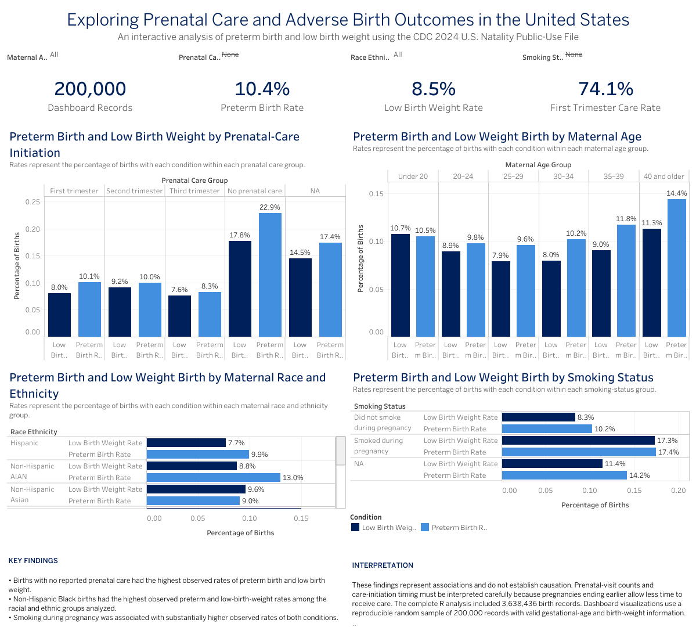

# Exploring Prenatal Care and Adverse Birth Outcomes

An exploratory analysis of the relationships among prenatal-care access, maternal characteristics, preterm birth, and low birth weight in the United States.

## Interactive Dashboard

[View the interactive Tableau Public dashboard](https://public.tableau.com/app/profile/adanya.bailey/viz/ExploringPrenatalCareandAdverseBirthOutcomes/PrenatalCareDashboard?publish=yes)



## Project Overview

Prenatal care provides opportunities to monitor a pregnancy, identify potential complications, and connect patients with appropriate services. However, access to care and adverse birth outcomes are not distributed equally across the United States.

This project examines how prenatal-care initiation and maternal characteristics differ across births involving two adverse outcomes:

* **Preterm birth:** Birth before 37 completed weeks of gestation
* **Low birth weight:** Birth weight below 2,500 grams

The project combines reproducible exploratory analysis in R with an interactive Tableau Public dashboard.

## Research Question

**How do prenatal-care access and maternal characteristics differ between preterm and full-term births?**

The analysis also explores low birth weight as an additional adverse outcome.

## Data Source

This project uses the **2024 United States Natality Public-Use File** from the Centers for Disease Control and Prevention’s National Center for Health Statistics.

* **Unit of observation:** One registered live birth
* **Full dataset:** 3,638,436 birth records
* **Dashboard dataset:** Reproducible random sample of 200,000 records with valid gestational-age and birth-weight information
* **Source:** [CDC Vital Statistics Online Data Portal](https://www.cdc.gov/nchs/data_access/vitalstatsonline.htm)
* **Documentation:** [2024 Natality User Guide](https://ftp.cdc.gov/pub/Health_Statistics/NCHS/Dataset_Documentation/DVS/natality/UserGuide2024.pdf)

The full raw dataset is not stored in this repository because of its size. Instructions and code for processing the original public-use file are included.

## Variables Examined

The analysis includes:

* Gestational age
* Birth weight
* Month prenatal care began
* Number of prenatal visits
* Maternal age
* Maternal race and ethnicity
* Maternal education
* Smoking during pregnancy
* Singleton versus multiple birth

See [`data_dictionary.md`](data_dictionary.md) for the original CDC variable names, coding definitions, and missing-value codes.

## Tools

* **R:** Fixed-width data import, cleaning, recoding, validation, exploratory analysis, and visualization
* **Tableau Public:** Interactive dashboard development
* **Git and GitHub:** Version control, documentation, and reproducibility
* **R packages:** `tidyverse`, `readr`, `ggplot2`, and `here`

## Data Preparation

The raw CDC fixed-width file was processed in R. The cleaning workflow:

1. Imported selected fields using their documented fixed-width positions.
2. Preserved the original CDC codes during import.
3. Converted unknown and not-stated codes to missing values.
4. Created readable demographic and prenatal-care categories.
5. Defined preterm birth as gestational age below 37 completed weeks.
6. Defined low birth weight as birth weight below 2,500 grams.
7. Validated variable ranges and missingness.
8. Saved the complete cleaned dataset for R analysis.
9. Produced a reproducible 200,000-record sample for Tableau.

## Key Findings

### Prenatal care

Births with no reported prenatal care had the highest observed adverse-outcome rates:

* **Preterm birth:** 23.5% with no prenatal care versus 10.1% with first-trimester care
* **Low birth weight:** 18.0% with no prenatal care versus 8.0% with first-trimester care

### Race and ethnicity

Non-Hispanic Black births had the highest observed rates among the racial and ethnic groups analyzed:

* **Preterm birth:** 14.9%
* **Low birth weight:** 15.0%

For comparison, the observed rates among non-Hispanic White births were 9.49% for preterm birth and 6.97% for low birth weight.

### Smoking during pregnancy

Smoking during pregnancy was associated with substantially higher adverse-outcome rates:

* **Preterm birth:** 17.2% among births with reported maternal smoking versus 10.2% without reported smoking
* **Low birth weight:** 17.1% among births with reported maternal smoking versus 8.28% without reported smoking

## Dashboard Features

The Tableau dashboard includes:

* Total dashboard records
* Preterm-birth rate
* Low-birth-weight rate
* First-trimester prenatal-care rate
* Comparisons by prenatal-care initiation
* Comparisons by maternal race and ethnicity
* Comparisons by maternal age
* Comparisons by smoking status
* Interactive demographic and prenatal-care filters

The KPI cards and visualizations update when filters are applied.

## Interpretation and Limitations

This is an exploratory, cross-sectional analysis. The findings demonstrate **associations, not causation**.

Additional limitations include:

* Birth-certificate data may contain missing, incomplete, or misreported information.
* Prenatal-care initiation does not measure the availability, continuity, or quality of care.
* Pregnancies ending earlier naturally provide less time to receive prenatal visits.
* A pregnancy must continue into a later trimester for prenatal care to begin during that trimester, creating a timing-related selection issue.
* Multiple births have a substantially higher baseline risk of preterm birth.
* The analysis does not adjust for all potential confounding variables.
* Tableau results may differ slightly from the complete-data R estimates because the dashboard uses a random sample.

Observed disparities should therefore be interpreted as patterns warranting further investigation rather than evidence that a single characteristic caused an outcome.

## Repository Structure

```text
prenatal-care-birth-outcomes/
├── data/
│   ├── raw/
│   └── processed/
├── scripts/
│   ├── 01_import_clean.R
│   └── 02_exploratory_analysis.R
├── output/
│   ├── figures/
│   └── tables/
├── dashboard/
├── README.md
├── data_dictionary.md
└── prenatal-care-birth-outcomes.Rproj
```

## Reproducing the Analysis

1. Download the 2024 U.S. Natality Public-Use File from the CDC.
2. Extract the fixed-width text file.
3. Place the text file in `data/raw/`.
4. Open `prenatal-care-birth-outcomes.Rproj` in RStudio.
5. Install the required packages:

```r
install.packages(c("tidyverse", "here"))
```

6. Run the scripts in order:

```r
source("scripts/01_import_clean.R")
source("scripts/02_exploratory_analysis.R")
```

The scripts will generate the cleaned data, summary tables, figures, and Tableau-ready CSV.

## Author

**Adanya Bailey**
Computer Science, Villanova University
Interested in biostatistics, public-health data analysis, and data visualization
